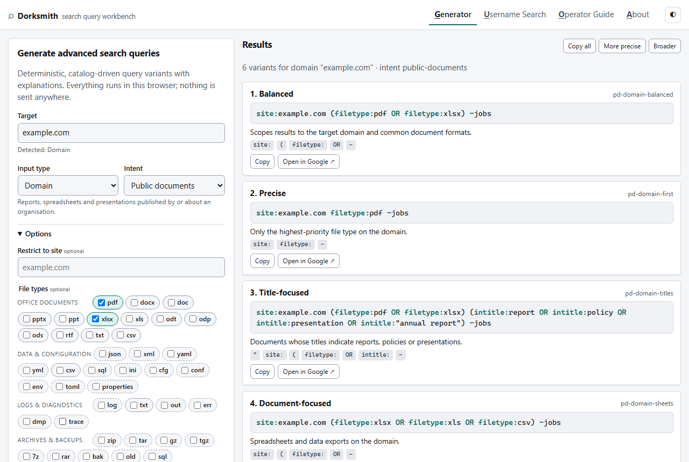
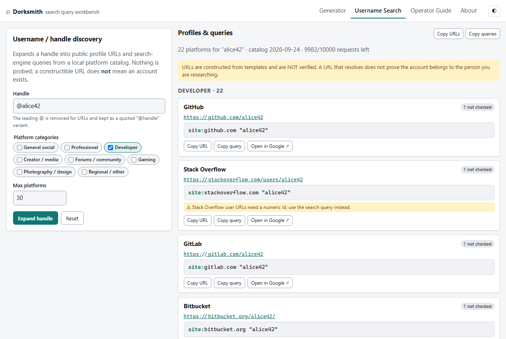

# Dorksmith — search query workbench

<!-- badges-start -->
[](https://github.com/aelena/search-query-workbench/actions/workflows/ci.yml) [](https://github.com/aelena/search-query-workbench/commits/main)

[](https://dotnet.microsoft.com/) [](src/Dorksmith.Api) [](web) [](src/Dorksmith.Api/Logging) [](compose.yaml)

[](tests/Dorksmith.Api.Tests) [](web/tests) [](.github/workflows/ci.yml) [](#main-features)

[](LICENSE) [](https://github.com/aelena/search-query-workbench/pulls) [](https://github.com/aelena/search-query-workbench) [](https://github.com/aelena/search-query-workbench/issues) [](https://github.com/aelena/search-query-workbench/stargazers)
<!-- badges-end -->

```plaintext

██████╗  ██████╗ ██████╗ ██╗  ██╗███████╗███╗   ███╗██╗████████╗██╗  ██╗
██╔══██╗██╔═══██╗██╔══██╗██║ ██╔╝██╔════╝████╗ ████║██║╚══██╔══╝██║  ██║
██║  ██║██║   ██║██████╔╝█████╔╝ ███████╗██╔████╔██║██║   ██║   ███████║
██║  ██║██║   ██║██╔══██╗██╔═██╗ ╚════██║██║╚██╔╝██║██║   ██║   ██╔══██║
██████╔╝╚██████╔╝██║  ██║██║  ██╗███████║██║ ╚═╝ ██║██║   ██║   ██║  ██║
╚═════╝  ╚═════╝ ╚═╝  ╚═╝╚═╝  ╚═╝╚══════╝╚═╝     ╚═╝╚═╝   ╚═╝   ╚═╝  ╚═╝
                                                                        
```
Most "dork generators" are either a static list of copy-pasted strings from 2012 (half of which still recommend `cache:` and `link:`), or a novelty wrapper around a language model that invents operators. Dorksmith is built like a small query compiler instead:

Dorksmith, is a fast, no-login web app that **compiles advanced search queries ("dorks")** for legitimate research: defensive exposure reviews, OSINT/SOCMINT, journalism, troubleshooting and plain power-searching.

Give it a target, an input type and an intent. It returns several ranked query variants, explains why each exists and which operators it uses, and warns when an operator is unreliable or no longer works. Everything is generated **deterministically from versioned JSON catalogs** — no LLM, no external AI API, no result scraping.

```
POST /api/v1/dorks/generate
{ "input": "example.com", "inputType": "domain", "intent": "public-documents",
  "options": { "fileTypes": ["pdf", "docx", "xlsx"], "excludeTerms": ["jobs"] } }

→ site:example.com (filetype:pdf OR filetype:docx OR filetype:xlsx) -jobs          Balanced
→ site:example.com filetype:pdf -jobs                                               Precise
→ site:example.com (filetype:pdf OR filetype:docx OR filetype:xlsx)
     (intitle:report OR intitle:policy OR intitle:presentation OR intitle:"annual report") -jobs   Title-focused
→ site:example.com (filetype:xlsx OR filetype:xls OR filetype:csv) -jobs            Document-focused
→ "example.com" (filetype:pdf OR filetype:docx OR filetype:xlsx) -site:example.com -jobs   Broad
→ site:example.com (filetype:pptx OR filetype:ppt) -jobs                            Document-focused
```

Same input + same catalog version = same output, every time.



---

## Contents

- [Main Features](#main-features)
- [Quick start](#quick-start)
- [Using the app](#using-the-app)
- [Examples](#examples)
- [API reference](#api-reference)
- [Configuration](#configuration)
- [Privacy defaults](#privacy-defaults)
- [Production deployment](#production-deployment)
- [Catalog maintenance](#catalog-maintenance)
- [Architecture](#architecture)
- [Development and testing](#development-and-testing)
- [Continuous integration](#continuous-integration)
- [Safety boundaries](#safety-boundaries)
- [Roadmap](#roadmap)

---

## Main features

| | Dorksmith |
|---|---|
| **Several variants, not one** | Balanced, Precise, Broad, Title-, URL- and Document-focused, Recent, Noise-reduced |
| **Explains itself** | Every variant carries an explanation, the operators it uses and a rank reason |
| **Operator registry is data** | `data/operators.google.json` records `official` / `working` / `unreliable` / `deprecated` per operator, with sources. Deprecated operators are never emitted |
| **Operator-aware autocomplete** | `si` → `site:`, `filetype:p` → `pdf`, a domain suggests domain intents — all client-side |
| **OSINT/SOCMINT workflows** | 36 intents including username discovery across 85 platforms, without probing anything |
| **Cheap to run** | One small VPS. Two containers. SQLite. No queues, no Redis, no GPUs |
| **No account, ever** | No registration, no auth cookies, no profiles |

---

## Quick start

### Docker (recommended)

```bash
git clone https://github.com/aelena/search-query-workbench.git
cd search-query-workbench
cp .env.example .env            # set IP_HMAC_SECRET (see below)
docker compose up --build
```

Open <http://localhost:7077>.

Topology: `web` (unprivileged nginx) serves the SPA and proxies `/api` and `/health` to `api` (ASP.NET Core 8, non-root, read-only filesystem). The search log lives in the named volume `dorksmith-state`.

### Without Docker

Requires the .NET 8 SDK.

```bash
dotnet run --project src/Dorksmith.Api
# → http://localhost:5080  (the API also serves the SPA from ./web in this mode)
```

```bash
dotnet test                     # 334 unit, golden and integration tests
```

---

## Using the app

Four sections, switchable with the tabs or <kbd>Alt</kbd>+<kbd>1</kbd>–<kbd>4</kbd>:

1. **Generator** — target, input type (auto-detected, overridable), intent, options, results.
2. **Username Search** — expands a handle into profile URLs and site-scoped queries by platform category.
3. **Operator Guide** — searchable operator cards with syntax, example, support badge, caveats and source links.
4. **About** — usage notice, keyboard reference, opt-in local history, catalog version.

Every result card has **Copy** and **Open in Google** (the URL is built client-side with `encodeURIComponent`; the server never returns redirect URLs). **Copy all** copies every variant, one per line. **More precise** / **Broader** adjust the structured controls and regenerate — no model involved.

Keyboard: <kbd>/</kbd> focuses the target box, <kbd>Ctrl</kbd>/<kbd>⌘</kbd>+<kbd>↵</kbd> generates, <kbd>↑</kbd> <kbd>↓</kbd> <kbd>↵</kbd> drive suggestions, <kbd>Esc</kbd> closes them.

### Input types

| Type | Detected from | Notes |
|---|---|---|
| `keyword` | anything else | multi-word phrases get quoted/wildcard variants |
| `person` | 2–3 capitalised words (`Alice Smith`) | reversed, initial and `*` middle-name variants |
| `organization` | choose manually | organisation name as an exact phrase |
| `domain` | `example.com`, `https://www.example.com/x` | scheme, path, port and `www.` are stripped |
| `url` | anything with a path | scheme-less citations, `inurl:` of the path |
| `username` | `@alice42` | `@` removed for URLs, kept as a quoted `"@alice42"` variant |
| `email` | `alice@example.com` | local part and domain are used separately |
| `filename` | `report.pdf` | stem + `filetype:` from the extension |
| `technology` | choose manually | "powered by", job postings, StackShare |

### Intents (36)

| Group | Intents |
|---|---|
| General discovery | broad web discovery · exact phrase · domain/site scoped · title-focused · URL-focused · page-text focused · date-bounded · exclude noise · documents by file type · URL references · troubleshooting |
| Organisation / domain OSINT | public documents · sub-domain references · contact pages · staff/profile references · technology mentions · developer references · cloud/storage references · support/status pages · presentations/reports |
| **Defensive exposure checks** | exposed configuration files · backups/archives · logs/diagnostics · directory listings · API documentation · error/debug pages · source maps · repository references |
| Person / identity OSINT | name variants · name + organisation · name + location · name + role · documents mentioning the person · social-profile-focused · email references |
| SOCMINT / username | platform-scoped profile search · exact username · username + display name |

Defensive intents are labelled in the UI and only accept `domain` input. They stop at query generation: nothing is fetched, verified or downloaded.

---

## Examples

All examples use `curl` against a local instance. Responses are abbreviated to the queries; the real payload includes `label`, `explanation`, `operators`, `warnings` and `rankReason` per variant.

### 1. Documents about a topic, recent only

```bash
curl -s localhost:7077/api/v1/dorks/generate -H 'content-type: application/json' -d '{
  "input": "quarterly roadmap", "inputType": "keyword", "intent": "documents",
  "options": { "fileTypes": ["pdf", "pptx"], "after": "2025-01-01", "maxVariants": 4 }
}' | jq -r '.variants[] | "\(.label)\t\(.query)"'
```
```
Document-focused   "quarterly roadmap" (filetype:pdf OR filetype:pptx) after:2025-01-01
Precise            "quarterly roadmap" filetype:pdf
Title-focused      intitle:"quarterly roadmap" (filetype:pdf OR filetype:pptx)
Broad              quarterly roadmap (filetype:pdf OR filetype:pptx)
```

### 2. Defensive exposure check on your own domain

```bash
curl -s localhost:7077/api/v1/dorks/generate -H 'content-type: application/json' -d '{
  "input": "example.com", "inputType": "domain", "intent": "exposed-config-files"
}' | jq -r '.variants[].query'
```
```
site:example.com (filetype:env OR filetype:ini OR filetype:cfg OR filetype:conf OR filetype:yml OR filetype:yaml OR filetype:toml OR filetype:properties)
site:example.com (inurl:".env" OR inurl:"config.php" OR inurl:"settings.py" OR inurl:"appsettings.json" OR inurl:"web.config" OR inurl:"wp-config")
site:example.com (intitle:"index of" OR intext:"parent directory") (".env" OR config OR settings)
site:example.com (inurl:docker-compose OR inurl:Dockerfile OR inurl:".htaccess" OR inurl:"nginx.conf" OR inurl:"httpd.conf")
site:example.com (inurl:".git" OR inurl:".svn" OR inurl:".hg" OR inurl:".DS_Store")
site:*.example.com -inurl:www (filetype:env OR filetype:ini OR filetype:cfg OR filetype:conf OR filetype:yml OR filetype:yaml OR filetype:toml OR filetype:properties)
```

Override the default extensions with `options.fileTypes` — e.g. `["yml", "yaml"]` to focus on CI and Kubernetes manifests.

### 3. Sub-domains, without touching DNS

```bash
curl -s localhost:7077/api/v1/dorks/generate -H 'content-type: application/json' \
  -d '{"input":"example.com","inputType":"domain","intent":"subdomain-references","options":{"maxVariants":3}}' \
  | jq -r '.variants[].query'
```
```
site:*.example.com -inurl:www
site:*.example.com -site:www.example.com -site:example.com
site:*.example.com (inurl:dev OR inurl:staging OR inurl:test OR inurl:uat OR inurl:api OR inurl:admin OR inurl:portal) -inurl:www
```

### 4. Person + organisation, with proximity

```bash
curl -s localhost:7077/api/v1/dorks/generate -H 'content-type: application/json' -d '{
  "input": "Alice Smith", "inputType": "person", "intent": "person-organization",
  "options": { "organization": "Example Corp", "maxVariants": 3 }
}' | jq -r '.variants[] | "\(.query)\n   ↳ \(.explanation)"'
```
```
"Alice Smith" "Example Corp"
   ↳ Both the name and the organisation as exact phrases.
"Alice Smith" AROUND(5) "Example Corp"
   ↳ AROUND(5) requires the phrases to be within five words, which filters incidental co-mentions.
"Alice Smith" "Example Corp" (filetype:pdf OR filetype:docx OR filetype:pptx)
   ↳ Documents mentioning both.
```

`person-organization`, `person-location`, `person-role` and `username-display-name` require the matching option; the API answers **422** with `field: "options.organization"` if it is missing.

### 5. Name variants

```bash
... -d '{"input":"Alice Smith","inputType":"person","intent":"person-name-variants","options":{"maxVariants":5}}'
```
```
"Alice Smith"
"Alice * Smith"        ← wildcard catches middle names and initials
"Smith Alice"          ← directory / citation ordering
intitle:"Alice Smith"
"Alice Smith" -site:pinterest.com -site:amazon.com -site:ebay.com
```

Raise `maxVariants` to see the remaining variants, e.g. `"A. Smith"` (first initial + surname) and the date-bounded one when `after`/`before` are supplied.

### 6. Username across platforms

```bash
curl -s localhost:7077/api/v1/dorks/generate -H 'content-type: application/json' \
  -d '{"input":"@alice42","inputType":"username","intent":"username-profiles","options":{"maxVariants":3}}' \
  | jq -r '.variants[].query'
```
```
"alice42" (site:x.com OR site:instagram.com OR site:facebook.com OR site:tiktok.com OR site:threads.net OR site:bsky.app)
"alice42" (site:github.com OR site:stackoverflow.com OR site:gitlab.com OR site:bitbucket.org OR site:news.ycombinator.com)
"alice42" (site:linkedin.com OR site:xing.com OR site:wellfound.com OR site:about.me)
```

Platform lists come from `data/platforms.json`, ordered by weight, so editing the catalog changes the queries without a code change.

### 7. Expand a handle into profile URLs

```bash
curl -s localhost:7077/api/v1/handles/expand -H 'content-type: application/json' \
  -d '{"username":"alice42","categories":["developer"],"maxPlatforms":3}' | jq
```
```json
{
  "username": "alice42",
  "normalizedUsername": "alice42",
  "notice": "URLs are constructed from templates and are NOT verified. A URL that resolves does not prove the account belongs to the person you are researching.",
  "profiles": [
    { "platformId": "github", "platformName": "GitHub", "category": "developer",
      "url": "https://github.com/alice42", "searchQuery": "site:github.com \"alice42\"", "status": "not-checked" },
    { "platformId": "stackoverflow", "platformName": "Stack Overflow", "category": "developer",
      "url": "https://stackoverflow.com/users/alice42", "searchQuery": "site:stackoverflow.com \"alice42\"",
      "status": "not-checked", "caveat": "Stack Overflow user URLs need a numeric id; use the search query instead." },
    { "platformId": "gitlab", "platformName": "GitLab", "category": "developer",
      "url": "https://gitlab.com/alice42", "searchQuery": "site:gitlab.com \"alice42\"", "status": "not-checked" }
  ],
  "queries": [ { "id": "ue-quoted", "label": "Balanced", "query": "\"alice42\"", "explanation": "The handle as an exact phrase." }, "…" ],
  "warnings": [],
  "catalogVersion": "2026-09-24"
}
```



`status` is always `not-checked`. Handles that are used as a sub-domain (`{username}.tumblr.com`) but contain characters invalid in a host name get `url: null` plus a caveat instead of a broken link.

### 8. Email address references

```bash
... -d '{"input":"alice@example.com","inputType":"email","intent":"email-mentions"}'
```
```
"alice@example.com"
"alice@example.com" -site:example.com           ← published elsewhere
"alice" site:example.com                        ← the local part on its own domain
intext:"alice@example.com"
"alice@example.com" (filetype:pdf OR filetype:docx OR filetype:xlsx OR filetype:txt)
"alice@example.com" (site:github.com OR site:linkedin.com OR site:x.com OR site:facebook.com)
```

### 9. Troubleshooting an error message

```bash
... -d '{"input":"ECONNRESET socket hang up","inputType":"technology","intent":"troubleshooting","options":{"maxVariants":3}}'
```
```
"ECONNRESET socket hang up" (site:stackoverflow.com OR site:github.com OR site:serverfault.com OR site:superuser.com)
"ECONNRESET socket hang up" site:github.com inurl:issues
"ECONNRESET socket hang up" (inurl:docs OR inurl:documentation OR intitle:documentation)
```

### 10. Validate a hand-written query (expert mode)

```bash
curl -s localhost:7077/api/v1/dorks/validate -H 'content-type: application/json' \
  -d '{"query":"cache:example.com site:example.com or filetype:.pdf"}' | jq
```
```json
{
  "query": "cache:example.com site:example.com or filetype:.pdf",
  "engine": "google",
  "operators": [
    { "token": "cache:", "name": "Cached copy", "support": "deprecated", "generate": false },
    { "token": "site:", "name": "Site restriction", "support": "official", "generate": true },
    { "token": "filetype:", "name": "File type", "support": "official", "generate": true }
  ],
  "warnings": [
    "Lower-case 'or' is treated as an ordinary word; use upper-case OR for a boolean operator.",
    "filetype: values take no leading dot (filetype:pdf).",
    "cache: is deprecated: No longer works. Use the Wayback Machine (web.archive.org) instead."
  ],
  "hasErrors": false
}
```

The query is never rewritten — validation only.

### 11. User text never becomes syntax

```bash
... -d '{"input":"-secret site:evil.com OR","inputType":"keyword","intent":"general-discovery","options":{"maxVariants":2}}'
```
```
"-secret" "site:evil.com" "OR"
"-secret site:evil.com OR"
```

Tokens that look like operators are quoted, so a pasted string cannot smuggle `-site:` exclusions or `OR` logic into a generated query. Exclusions in `options.excludeTerms` do allow known, generatable operators (`site:pinterest.com` → `-site:pinterest.com`), but deprecated ones are neutralised (`cache:x` → `-"cache:x"`).

---

## API reference

Base path `/api/v1`, JSON in and out. Errors always use one shape:

```json
{ "error": "invalid_input", "message": "A valid domain is required for inputType=domain.", "field": "input" }
```

| Status | `error` | When |
|---|---|---|
| 400 | `invalid_input` | malformed JSON, unknown type/intent, invalid domain/email/URL/username, bad dates, limits exceeded |
| 404 | `not_found` / `feature_disabled` | unknown engine; username search disabled |
| 413 | `payload_too_large` | body over 16 KB |
| 422 | `cannot_generate` | intent incompatible with the input type, required option missing, nothing generatable |
| 429 | `rate_limit_exceeded` | hourly quota exhausted; includes `retryAfterSeconds` and `Retry-After` |
| 500 | `internal_error` | never includes stack traces |
| 503 | `not_ready` | catalogs failed validation |

### `POST /dorks/generate`

Request:

```json
{
  "input": "example.com",
  "inputType": "domain",
  "intent": "public-documents",
  "engine": "google",
  "options": {
    "fileTypes": ["pdf", "docx"],
    "excludeTerms": ["jobs", "privacy policy", "site:pinterest.com"],
    "after": "2024-01-01",
    "before": "2024-12-31",
    "site": null,
    "maxVariants": 6,
    "organization": null, "location": null, "role": null, "displayName": null
  }
}
```

Response:

```json
{
  "requestId": "01M3AF3RJMRTYGD22MVN2SNWWS",
  "catalogVersion": "2026-09-24",
  "engine": "google", "intent": "public-documents", "inputType": "domain", "normalizedInput": "example.com",
  "variants": [
    {
      "id": "pd-domain-balanced",   // the "Recent" family (pd-domain-recent) carries after:/before: when dates are supplied
      "label": "Balanced",
      "family": "balanced",
      "query": "site:example.com (filetype:pdf OR filetype:docx) -jobs -\"privacy policy\" -site:pinterest.com",
      "explanation": "Scopes results to the target domain and common document formats.",
      "operators": ["\"", "site:", "(", "filetype:", "OR", "-"],
      "warnings": [],
      "rankReason": "weight 100 · +10 intent · +10 exact input type · +22 operator reliability · −6 complexity · +15 new family (balanced)"
    }
  ],
  "rateLimit": { "limit": 25, "remaining": 24, "resetAtUtc": "2026-09-24T16:00:00+00:00" }
}
```

Headers: `X-Request-Id`, `RateLimit-Limit`, `RateLimit-Remaining`, `RateLimit-Reset`, `Cache-Control: no-store`.

Limits (all configurable): input ≤ 500 chars, ≤ 20 excluded terms, ≤ 10 file types, 1–12 variants (default 6), context fields ≤ 200 chars.

### `POST /dorks/validate`

`{ "query": "…", "engine": "google" }` → operators used with support state, warnings, `hasErrors`.

### `POST /handles/expand`

`{ "username": "alice42", "categories": ["general-social"], "platformIds": ["github"], "maxPlatforms": 30 }` → profiles (`status` always `not-checked`), queries, warnings. Shares the hourly quota with generation.

### `GET /operators?engine=google` · `GET /intents` · `GET /filetypes` · `GET /platforms?q=git&category=developer`

Catalog resources. All return `ETag` and `Cache-Control: public, max-age=300`; send `If-None-Match` to get `304`.

### `GET /config/public`

Non-secret runtime settings the SPA needs:

```json
{ "maxVariants": 12, "defaultVariants": 6, "maxQueryLength": 500, "rateLimitEnabled": true, "rateLimitPerHour": 25,
  "supportedEngines": ["google"], "usernameSearchEnabled": true, "maxUsernameLength": 100, "maxPlatforms": 100,
  "searchLogEnabled": true, "searchLogRetentionDays": 30, "ipLoggingMode": "hmac", "catalogVersion": "2026-09-24" }
```

### `GET /health/live` · `GET /health/ready`

Liveness is unconditional. Readiness fails (503) if any catalog is malformed or the SQLite log is unreachable:

```json
{ "status": "Healthy", "checks": [ { "name": "catalogs", "status": "Healthy", "description": "catalog 2026-09-24" },
                                    { "name": "search-log", "status": "Healthy", "description": "sqlite /app/state/dorksmith.db" } ] }
```

---

## Configuration

Environment variables (flat names map onto `appsettings.json` sections; the standard `Section__Key` form works too):

| Variable | Default | Purpose |
|---|---|---|
| `APP_ENVIRONMENT` | `Production` | `Development` enables readable console logs and a 500/h limit |
| `RATE_LIMIT_ENABLED` | `true` | per-client quota on generate/expand |
| `RATE_LIMIT_PERMIT_LIMIT` | `25` | requests per window |
| `RATE_LIMIT_WINDOW_MINUTES` | `60` | fixed window length |
| `SEARCH_LOG_ENABLED` | `true` | write one row per request |
| `SEARCH_LOG_RETENTION_DAYS` | `30` | rows older than this are deleted hourly; `0` keeps forever |
| `SQLITE_PATH` | `/app/state/dorksmith.db` | `:memory:` for tests |
| `IP_LOGGING_MODE` | `Hmac` | `Hmac` · `Raw` · `None` |
| `IP_HMAC_SECRET` | *(unset)* | **set this** — ≥ 16 chars; unset means an ephemeral per-process key |
| `MAX_QUERY_LENGTH` | `500` | main input length |
| `MAX_VARIANTS` | `12` | upper bound for `options.maxVariants` |
| `DEFAULT_VARIANTS` | `6` | when the client omits it |
| `USERNAME_SEARCH_ENABLED` | `true` | hides the tab and 404s the endpoint when `false` |
| `USERNAME_MAX_PLATFORMS` | `100` | cap for `maxPlatforms` |
| `CORS_ALLOWED_ORIGINS` | *(empty = same-origin only)* | comma-separated list |
| `KNOWN_PROXIES` / `KNOWN_NETWORKS` | *(empty = trust nothing)* | which hops may set `X-Forwarded-For`; Compose sets the Docker networks |
| `FORWARD_LIMIT` | `1` | hops to unwind: `1` nginx only, `2` Caddy → nginx |
| `CATALOG_PATH` | `data` | catalog directory (read-only mount in Docker) |
| `SERVE_STATIC` / `WEB_PATH` | `true` / `web` | let the API serve the SPA (dev / single container) |

Generate a secret:

```bash
openssl rand -hex 32
```

---

## Privacy defaults

- **What is logged:** one row per generate/expand request: id, UTC time, client key, IP mode, input type, intent, engine, normalised input, options JSON, variant count, HTTP status, duration, catalog version, and a coarse user-agent family (`browser` / `cli` / `bot` / `other`). Nothing else. No headers, cookies, fingerprints or results.
- **Client key:** `HMAC-SHA256(IP_HMAC_SECRET, normalized_ip)` by default. IPv4-mapped IPv6 addresses are normalised first so the same client gets the same key. The raw IP exists only in memory during the request. `Raw` stores the address; `None` stores nothing (rate limiting still works from a transient HMAC).
- **Retention:** 30 days by default, enforced by a background job; configurable, documented in the app's About tab and footer (values come from `/config/public`).
- **Rate limiting:** 25 requests per hour per client by default. Catalog reads are never limited.
- **No cookies.** Optional local history and theme preference live in the browser's `localStorage` only, behind an explicit opt-in.
- **Search log storage:** SQLite in WAL mode with parameterised statements, behind `ISearchLogStore` so it can be replaced (Postgres, Azure Tables) without touching endpoints.

---

## Production deployment

### Recommended: one small VPS with Compose + Caddy

```bash
# on the server
git clone https://github.com/aelena/search-query-workbench.git /opt/dorksmith && cd /opt/dorksmith
cp .env.example .env && $EDITOR .env        # IP_HMAC_SECRET, rate limits, retention
DORKSMITH_DOMAIN=dorks.example.org ACME_EMAIL=ops@example.org \
  docker compose -f compose.yaml -f compose.prod.yaml up -d --build
```

`compose.prod.yaml` adds a `caddy` container (ports 80/443, automatic TLS, HSTS), stops publishing nginx directly and sets `FORWARD_LIMIT=2` so the API sees the real client address behind Caddy → nginx.

Checklist:

- provider firewall: allow 22/80/443 only;
- unattended security updates for the host (`unattended-upgrades`) and periodic `docker compose pull && up -d --build`;
- nightly encrypted backup of the state volume — `deploy/backup-sqlite.sh` snapshots the database with SQLite's online backup and encrypts with GPG; run it from cron;
- external uptime check on `https://your-host/health/ready`;
- logs are JSON on stdout (`docker compose logs api`), ready for any container log shipper.

Both containers run as non-root with a read-only filesystem, all capabilities dropped and `no-new-privileges`.

### Managed alternatives

The API image runs unchanged on Azure Container Apps, Fly.io, Render or similar. Two caveats when scaling past one instance: the in-memory quota is per instance (implement `IRequestQuotaService` over Redis or another atomic store), and SQLite should give way to a shared `ISearchLogStore`. Object storage is fine for archived logs but not as the online counter store.

Kubernetes is deliberately not part of the MVP.

---

## Catalog maintenance

All knowledge lives in `data/` and is validated on startup. A broken catalog fails `/health/ready` with the reason, so a typo can never ship silently.

| File | Contents |
|---|---|
| `operators.google.json` | 40 operators: token, syntax, description, example, `support`, `generate`, caveats, source URLs |
| `intents.json` | 8 variant families, 5 groups, 36 intents, ~230 templates |
| `filetypes.json` | 55 extensions in 6 groups with autocomplete weights and a `defensive` flag |
| `platforms.json` | 85 platforms in 8 categories with URL templates, search domains and optional username rules |

### Adding or changing an operator

```json
{
  "token": "related:",
  "name": "Related sites",
  "support": "deprecated",
  "generate": false,
  "caveats": ["Removed; still appears in many third-party lists."],
  "sourceUrls": ["https://developers.google.com/search/updates"]
}
```

Rules enforced by the validator: `deprecated` ⇒ `generate:false`; `generate:true` ⇒ `official` or `working`; no template pattern may contain a non-generatable operator. Bump `catalogVersion` when you change behaviour.

### Adding a template

Templates are patterns with placeholders. Composite placeholders always resolve to complete syntax or to nothing, so a template never leaves a dangling `site:` behind:

```json
{
  "id": "pd-domain-sheets",
  "family": "document-focused",
  "when": ["domain"],
  "pattern": "{site} (filetype:xlsx OR filetype:xls OR filetype:csv) {exclusions}",
  "weight": 75,
  "explanation": "Spreadsheets and data exports on the domain."
}
```

Frequently used placeholders:

| Placeholder | Resolves to |
|---|---|
| `{terms}` / `{quoted}` / `{termsAny}` | `quarterly roadmap` / `"quarterly roadmap"` / `(quarterly OR roadmap)` |
| `{intitle}` `{inurl}` `{intext}` (+`Any`) | `intitle:"quarterly roadmap"`, `(inurl:quarterly OR inurl:roadmap)` |
| `{phraseWildcard}` `{quotedReversed}` `{quotedInitialLast}` | `"Alice * Smith"`, `"Smith Alice"`, `"A. Smith"` |
| `{site}` `{siteWildcard}` `{excludeSite}` `{domainQuoted}` `{domainLabel}` `{atDomainQuoted}` | `site:example.com`, `site:*.example.com`, `-site:example.com`, `"example.com"`, `"example"`, `"@example.com"` |
| `{quotedUsername}` `{atUsername}` `{inurlUsername}` `{hashtagUsername}` | `"alice42"`, `"@alice42"`, `inurl:alice42`, `#alice42` |
| `{emailQuoted}` `{emailUserQuoted}` · `{urlQuoted}` `{urlBareQuoted}` `{inurlPath}` · `{filenameStem}` `{filetypeFromFilename}` | per input type |
| `{filetypeGroup}` `{filetypeFirst}` | from `options.fileTypes`, else the template's `fileTypes`, else the intent's `defaultFileTypes` |
| `{exclusions}` `{dates}` `{after}` `{before}` `{siteOption}` `{context}` | optional by default — empty when not supplied |
| `{keywords}` | OR-group of the template's `keywords` list |
| `{platformSites}` | `(site:a OR site:b …)` from `platformIds` or `platformCategories` + `platformLimit` |
| `{organization}` `{location}` `{role}` `{displayName}` | quoted option values |

A placeholder that resolves to nothing disqualifies the template unless it is optional (`exclusions`, `dates`, `after`, `before`, `site`, `siteOption`, `context`) — override per template with `requires` / `optional`. The full list is in `src/Dorksmith.Api/Generation/Placeholders.cs`.

**Every template must be covered by a golden test.** Fixtures live in `tests/Dorksmith.Api.Tests/Golden/fixtures/*.json` (input + type + intent + options → expected ordered variants). After adding or changing templates:

```bash
DORKSMITH_UPDATE_GOLDEN=1 dotnet test --filter GoldenTests    # rewrites expected output
git diff tests/Dorksmith.Api.Tests/Golden/fixtures             # review the change
dotnet test                                                     # coverage test fails if a template has no fixture
```

### Adding a platform

```json
{ "id": "codeberg", "name": "Codeberg", "category": "developer",
  "profileUrlTemplate": "https://codeberg.org/{username}", "searchDomain": "codeberg.org",
  "enabled": true, "caseSensitive": false, "weight": 50,
  "caveat": "optional text shown to the user",
  "usernameRule": { "pattern": "^[A-Za-z0-9-]+$", "note": "shown when the handle does not match" } }
```

Templates must be `https://` and contain `{username}`. Set `enabled:false` to keep a record without emitting it.

Sources used for the operator catalog: Google Search Help (*Refine Google searches*), Google Search Central updates, Google Guide's operator reference and Ahrefs' operator list. First-party documentation wins on conflicts; a Google removal notice always overrides third-party lists.

---

## Architecture

```
raw input → normalise → classify/validate → load intent templates → resolve placeholders
          → drop invalid → canonicalise → de-duplicate → score & rank → top N + explanations
```

```
src/Dorksmith.Api
  Program.cs                 host: options, DI, forwarded headers, CORS, health, endpoints
  Endpoints/                 Dork, Handle, Catalog, Config, Health (minimal API)
  Generation/                QueryNormalizer · QueryQuoting · RequestValidator · PlaceholderResolver
                             QueryValidator (operator scanner) · CandidateRanker · DorkGenerator
  Handles/HandleExpander     platform expansion, no probing
  Catalogs/                  models, JsonCatalogProvider (+ETags), CatalogValidator, health check
  RateLimiting/              IRequestQuotaService, InMemoryRequestQuotaService, headers
  Logging/                   ISearchLogStore, SqliteSearchLogStore (+embedded migrations), retention job
  Privacy/ClientKeyProvider  IP normalisation + HMAC
  Http/                      error envelope, security headers, static SPA, JSON body reader, ULID ids
web/                         index.html + css/app.css + ES modules (no build step)
  js/app.js                  shell: tabs, theme, shortcuts, notices
  js/generator-ui.js         form ↔ API, cards, copy/open
  js/autocomplete.js         suggestion engine + listbox
  js/validator.js            client-side syntax warnings
  js/operators-ui.js         operator guide
  js/handles-ui.js           username search
  js/api.js · storage.js · clipboard.js · query-format.js · dom.js
data/                        versioned catalogs
tests/Dorksmith.Api.Tests    unit · golden · integration (xunit + WebApplicationFactory)
web/tests                    Playwright browser tests (test-only Node dependency)
```

Ranking (`CandidateRanker`):

```
score = template_weight + intent_match (+10) + input_type_match (+10)
      + operator_reliability (official +4, working +2, unreliable −10, unknown −15)
      − deprecated_penalty (−30) − complexity (−3 per operator beyond 4) − long_query (−5)
      + diversity_bonus (+15 for the first variant of each family)
      − similarity_penalty (up to −20 when Jaccard token overlap with a selected variant > 0.7)
```

Ties break on catalog order, so output is stable. Duplicates are removed after canonicalisation (collapsed whitespace, lower-cased operator prefixes, upper-cased `OR`).

Security headers on every response: strict CSP (`default-src 'self'`, no inline script/style), `X-Content-Type-Options: nosniff`, `X-Frame-Options: DENY`, `Referrer-Policy`, `Permissions-Policy`. The SPA never uses `innerHTML` with data; all text goes through `textContent`.

---

## Development and testing

```bash
dotnet build
dotnet test                                    # 334 tests: unit, golden, integration
dotnet run --project src/Dorksmith.Api         # http://localhost:5080 with the SPA served by the API
```

Browser tests (Chromium via Playwright; Node is a **test-only** dependency):

```bash
cd web/tests
npm install && npx playwright install chromium
npx playwright test            # starts `dotnet run` itself, or set DORKSMITH_BASE_URL to reuse a server
```

They cover the generate flow, copy, autocomplete keyboard navigation, operator guide search and filters, username expansion, error rendering (400/422/429) and keyboard shortcuts.

CI (`.github/workflows/ci.yml`): build + tests + `dotnet list package --vulnerable`, Playwright suite, and both container images.

Performance: generation is pure in-memory template expansion; a full 12-variant request takes well under 5 ms on a laptop, and catalogs are pre-serialised with ETags so the SPA's first load is one HTML file, one stylesheet and ten small modules — no bundler, no third-party scripts.

---

## Continuous integration

`.github/workflows/ci.yml` runs on every push to `main` and on every pull request, with read-only repository permissions. It has three jobs; the badge at the top of this page reflects the latest run.

| Job | Runs on | What it does |
|---|---|---|
| **backend** | `ubuntu-latest`, .NET 8 SDK | `dotnet restore` → `dotnet build -c Release` → `dotnet test` (unit, golden and integration tests) → dependency vulnerability scan. Test results (`.trx`) are uploaded as an artifact even when the job fails. |
| **frontend** | `ubuntu-latest`, .NET 8 SDK + Node 20 | Needs **backend** to pass first. Builds the API, runs `npm ci` in `web/tests` (the lock file drives the npm cache), installs Chromium with its system dependencies, then runs the Playwright suite with `CI=true` (one retry per test, HTML report). The report is uploaded only on failure. |
| **containers** | `ubuntu-latest`, Buildx | Builds the API image (`src/Dorksmith.Api/Dockerfile`, repository root as context) and the web image (`web/`). Nothing is pushed; this proves both Dockerfiles stay buildable. |

The vulnerability gate is deliberately simple:

```bash
dotnet list Dorksmith.sln package --vulnerable --include-transitive | tee vuln.txt
if grep -q "has the following vulnerable packages" vuln.txt; then exit 1; fi
```

`dotnet list package --vulnerable` queries the GitHub Advisory Database through nuget.org, and `--include-transitive` matters: both findings fixed so far were transitive (a native SQLite library pulled in by `Microsoft.Data.Sqlite`, and an older `System.Text.Json` pulled in by the test host). The fix in those cases is an explicit `PackageReference` to a patched version, which NuGet then prefers over the transitive one.

Reproduce the whole pipeline locally:

```bash
dotnet build -c Release && dotnet test -c Release --no-build
dotnet list Dorksmith.sln package --vulnerable --include-transitive
cd web/tests && npm ci && npx playwright install chromium && npx playwright test && cd ../..
docker compose build
```

Extending it: to publish images, add a registry login step and set `push: true` with `tags` pointing at your registry in the **containers** job; to run on a schedule (for example a weekly vulnerability re-scan), add a `schedule:` trigger with a cron expression under `on:`.

---

## Safety boundaries

Dorksmith generates public-search queries and public profile URLs. It does not, and will not:

- fetch, scrape or parse search-engine result pages;
- probe platforms to determine whether an account exists (Sherlock/Maigret style) — any future adapter would sit behind a separate `IUsernameProbe` interface with bounded concurrency, timeouts, per-platform enable flags and no CAPTCHA/auth bypass;
- validate, use or store discovered secrets, passwords or tokens;
- download exposed datasets or enumerate targets at scale;
- offer proxy rotation, credential stuffing, exploitation or intrusion functionality.

Defensive exposure checks are for systems you own or are authorised to assess. Users are responsible for lawful use; the notice is shown in the app.

---

## Roadmap

- Bing / DuckDuckGo operator catalogs (the engine is already keyed by `engine`).
- Permalinks encoded entirely in the URL fragment.
- Export variants as TXT/JSON/CSV; local favourites and reusable recipes.
- Side-by-side variant comparison and organisation research packs.
- Distributed quota store for multi-instance deployments.
- Signed, versioned catalog releases with a self-hosted update mechanism.

---

Licence: MIT. Working name "Dorksmith"; rename freely.
